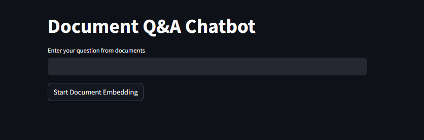
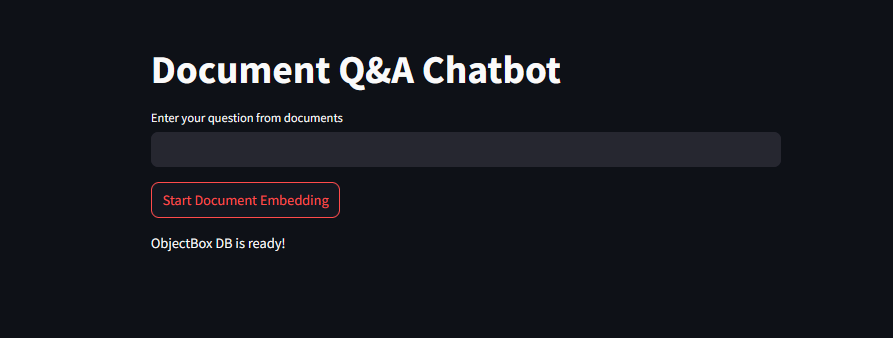
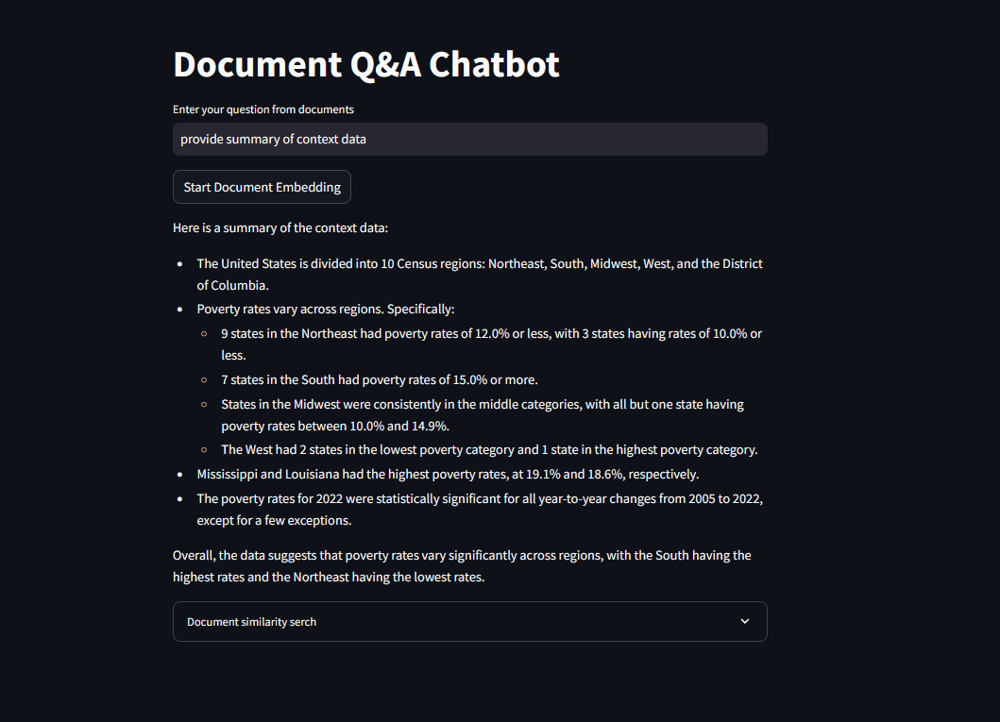
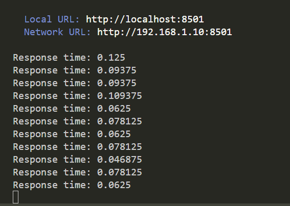
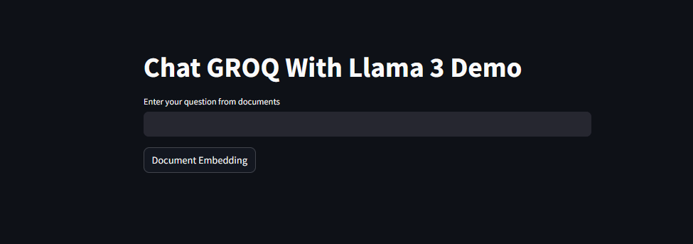
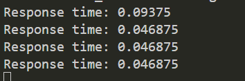

# Chatbot with Groq and LangChain

## 📌 Project Overview

This project is a **Streamlit-based AI chatbot** that utilizes **Groq's LLM API** with **LangChain** for intelligent responses. It now integrates **ObjectBox** as a vector database, replacing FAISS, for **retrieval-augmented generation (RAG)**. ObjectBox provides a high-performance, lightweight vector storage solution, enabling efficient document searching and fast query responses.

## 🚀 Features

- **Groq API Integration**: Uses `Llama3-8b-8192` for text generation.
- **Streamlit UI**: Interactive chatbot interface.
- **LangChain-based Retrieval**: Efficient document retrieval using ObjectBox.
- **PDF Document Embedding**: Supports loading and searching within PDF files.
- **ObjectBox Vector Store**: Provides a high-speed, scalable, and persistent vector database.
- **Environment Variable Support**: Secure API key storage with `.env`.

## 📂 Project Structure

```
DOC_QA_CHATBOT/
├── doc_qa_chatbot/           # Project root directory
│   ├── groq/                 # Contains Groq-related modules
│   ├── objectbox/            # Contains ObjectBox-related modules
│   ├── us_census/            # Directory containing PDF documents
│   │   ├── acsbr-015.pdf
│   │   ├── acsbr-016.pdf
│   │   ├── acsbr-017.pdf
│   │   ├── p70-178.pdf
│   ├── app.py                # Main Streamlit application
│   ├── screenshots/          # Project screenshots
├── .env                      # Stores API keys (not uploaded to the repo.)
├── .gitignore                # Ignores sensitive files in version control
├── README.md                 # Project documentation
├── requirements.txt          # Python dependencies
```

## 🛠 Installation

### 1️⃣ **Clone the Repository**

```bash
git clone https://github.com/MAhad01/doc_q-a_chatbot
cd yourrepo
```

### 2️⃣ **Create a Virtual Environment**

```bash
python -m venv venv
source venv/bin/activate   # On Mac/Linux
venv\Scripts\activate      # On Windows
```

### 3️⃣ **Install Dependencies**

```bash
pip install -r requirements.txt
```

### 4️⃣ **Set Up Environment Variables**

- Create a `.env` file in the root directory.
- Add your **Groq API Key**:
  ```ini
  GROQ_API_KEY="your_api_key_here"
  ```

## ▶️ Running the Application

```bash
streamlit run app.py
```

The chatbot will be accessible at `http://localhost:8501/`.

## 📸 Screenshots

### Chat Interface



### Response Example



### Response Time



## 🔍 Why ObjectBox?

ObjectBox is a **high-performance embedded database** designed for fast and efficient data storage. By integrating ObjectBox as the vector database, this project benefits from:

- **Lightning-fast retrieval speeds** for document embeddings.
- **Efficient storage management** for vector-based queries.
- **Scalability & Persistence**, ensuring that stored embeddings are retained even after the application restarts.
- **Low-memory footprint**, making it ideal for edge devices or lightweight deployments.

## 🏗 Technologies Used

- [**Streamlit**](https://streamlit.io/) - Web framework for UI
- [**LangChain**](https://python.langchain.com/) - LLM integration
- [**Groq**](https://groq.com/) - AI model hosting
- [**ObjectBox**](https://objectbox.io/) - Vector database
- [**PyPDFLoader**](https://python.langchain.com/docs/modules/data_connection/document_loaders/integrations/pypdf/) - PDF document loading


---

💡 **Feel free to contribute!** If you encounter any issues, create a GitHub issue or submit a pull request.


<!-- # Document Q&A Chatbot using Llama 3, Groq API and LangChain

## 📌 Project Overview

This project is a **Streamlit-based AI chatbot** that uses **Groq's LLM API** with **LangChain** for intelligent responses. It implements **Retrieval-Augmented Generation (RAG)** via **FAISS** to enhance the accuracy of responses by incorporating document-based information retrieval. The process follows these steps:

1. **Document Embedding:**
   - The chatbot loads PDF documents from the `us_census/` directory.
   - The documents are split into smaller chunks for efficient searching.
   - FAISS (Facebook AI Similarity Search) is used to store these chunks as vector embeddings.

2. **Retrieval:**
   - When a user asks a question, the chatbot retrieves the most relevant document chunks based on semantic similarity.
   - FAISS quickly finds matching document sections related to the query.

3. **Augmented Response Generation:**
   - The retrieved document snippets are provided as context to the **Llama 3 model** via LangChain.
   - The model then generates an answer based strictly on the relevant context, improving factual accuracy.

This RAG approach ensures that the chatbot provides **accurate**, **contextual**, and **relevant** responses rather than relying solely on the language model’s internal knowledge.

## 🚀 Features

- **Groq API Integration**: Uses `Llama3-8b-8192` for text generation.
- **Streamlit UI**: Interactive chatbot interface.
- **LangChain-based Retrieval**: Efficient document retrieval using FAISS.
- **PDF Document Embedding**: Supports loading and searching within PDF files.
- **Environment Variable Support**: Secure API key storage with `.env`.

## 📂 Project Structure

```
├── .env                      # Stores API keys (DO NOT SHARE!)
├── .gitignore                # Ignores sensitive files in version control
├── requirements.txt          # Python dependencies
├── app.py                    # Main Streamlit application
├── us_census/                # Directory containing PDF documents
├── screenshots/              # Project screenshots
└── README.md                 # Project documentation
```

## 🛠 Installation

### 1️⃣ **Clone the Repository**

```bash
git clone https://github.com/MAhad01/doc_q-a_chatbot
cd yourrepo
```

### 2️⃣ **Create a Virtual Environment**

```bash
python -m venv venv
source venv/bin/activate   # On Mac/Linux
venv\Scripts\activate      # On Windows
```

### 3️⃣ **Install Dependencies**

```bash
pip install -r requirements.txt
```

### 4️⃣ **Set Up Environment Variables**

- Create a `.env` file in the root directory.
- Add your **Groq API Key**:
  ```ini
  GROQ_API_KEY="your_api_key_here"
  ```

## ▶️ Running the Application

```bash
streamlit run app.py
```

The chatbot will be accessible at `http://localhost:8501/`.

## 📸 Screenshots

### Chat Interface


### Response Example


### Response Time



## 🏗 Technologies Used

- [**Streamlit**](https://streamlit.io/) - Web framework for UI
- [**LangChain**](https://python.langchain.com/) - LLM integration
- [**Groq**](https://groq.com/) - AI model hosting
- [**FAISS**](https://github.com/facebookresearch/faiss) - Vector database
- [**PyPDFLoader**](https://python.langchain.com/docs/modules/data_connection/document_loaders/integrations/pypdf/) - PDF document loading

---

💡 **Feel free to contribute!** If you encounter any issues, create a GitHub issue or submit a pull request.
 -->
